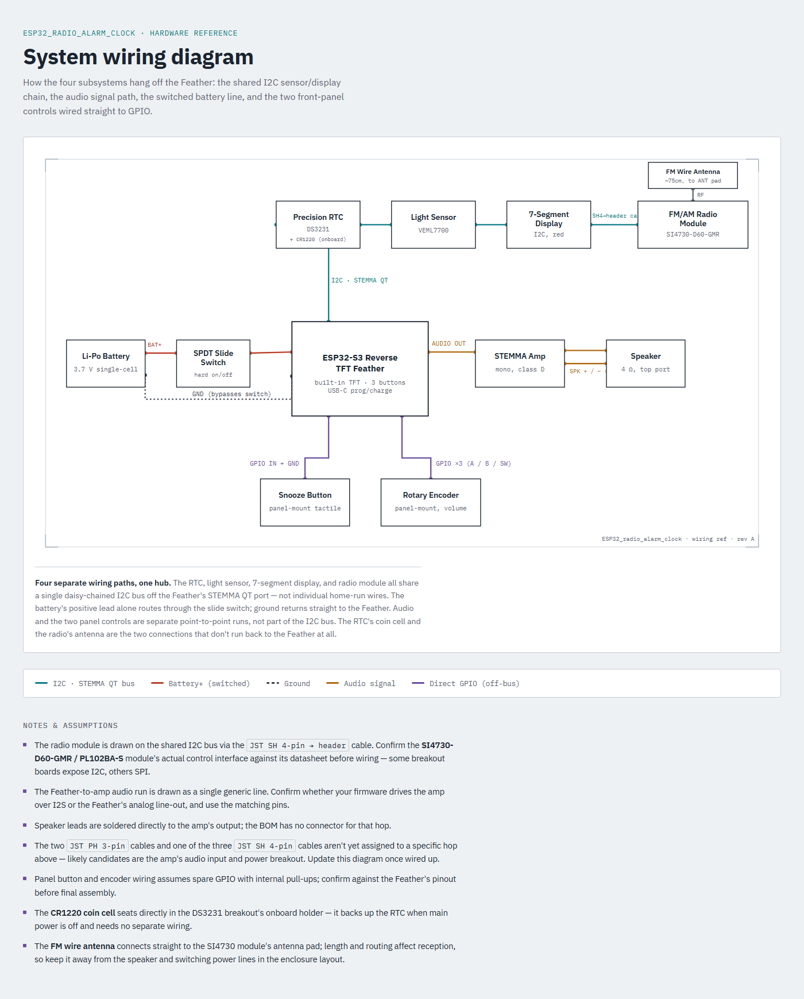

# ESP32_radio_alarm_clock

## Hardware

| Qty | Part | Manufacturer P/N | DigiKey P/N | Purpose |
|---|---|---|---|---|
| 1 | Adafruit ESP32-S3 Reverse TFT Feather | 5691 | 1528-5691-ND | Main MCU + built-in TFT display |
| 1 | Adafruit STEMMA QT DS3231 Precision RTC | 5188 | 1528-5188-ND | Timekeeping |
| 1 | Adafruit STEMMA QT VEML7700 Sensor | 4162 | 1528-2891-ND | Ambient light sensing for automatic dimming of the 7-segment and TFT displays |
| 1 | Adafruit Addressable LED 7-Segment I2C (Red) | 1270 | 1528-1876-ND | Clock time display |
| 1 | Adafruit STEMMA Audio Amp - Mono | 5647 | 1528-5647-ND | Audio amplification |
| 3 | JST SH 4-Pin Cable - Qwiic Compatible | 4210 | 1528-4210-ND | STEMMA QT interconnects |
| 1 | JST SH 4-Pin to Premium Male Header Cable | 4209 | 1528-4209-ND | STEMMA QT to header breakout |
| 2 | JST PH 3-Pin to Male Header Cable | 3893 | 1528-2696-ND | Power/signal breakout |
| 1 | Speaker 4 Ohm, Top Port | 3351 | 3351-ND | Alarm/radio audio output |
| 1 | SI4730-D60-GMR AM/FM Receiver Module (PL102BA-S V2.1, DSP Digital Tuner) | SI4730-D60-GMR | — | AM/FM radio tuner |
| 1 | Panel-mount tactile button | TBD | TBD | Dedicated front-panel snooze button, separate from the Feather's onboard buttons |
| 1 | Panel-mount rotary encoder | TBD | TBD | Physical volume control |
| 1 | Lithium battery | TBD | TBD | Power source |
| 1 | Inline SPDT slide switch | TBD | TBD | Hard on/off, wired inline on the battery line |
| 1 | CR1220 coin cell | TBD | TBD | RTC backup power, seats in the DS3231 breakout's onboard holder |
| 1 | FM wire antenna | TBD | TBD | Antenna for the SI4730 AM/FM receiver module |

Rendered from [`docs/wiring-diagram.html`](docs/wiring-diagram.html), which has the full interactive version plus wiring notes/assumptions.

## Controls

- **Snooze**: dedicated panel-mount tactile button, front-mounted for easy reach, wired separately from the Feather's onboard top-mounted menu buttons.
- **Volume**: small panel-mount rotary encoder for physical volume control.
- **Power**: inline SPDT slide switch on the battery line for a hard on/off.
- **Menu**: more advanced settings/controls are handled via an on-screen menu on the Feather's built-in TFT, navigated using the Feather's onboard buttons.

## Planned Features

- **Web dashboard**: the ESP32-S3's WiFi hosts a web dashboard mirroring the menu items, for faster/easier setup from a phone.
  - First connection: phone joins the ESP32's own WiFi access point (AP mode).
  - From the dashboard, the user can then configure the ESP32 to join the home WiFi network.
  - Once on the home network, the device is reachable at a `.local` (mDNS) address instead of the AP.

## Enclosure

A 3D-printed case will be designed to house all components in the final form factor. CAD/STL files will live under [`enclosure/`](enclosure/).

