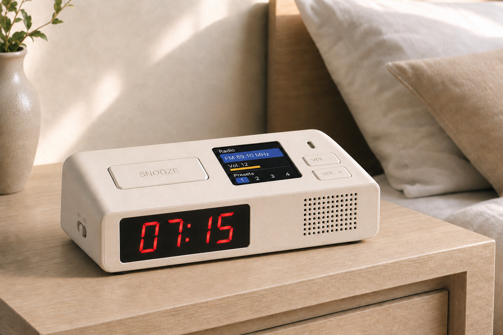

# ESP32 Radio Alarm Clock

*A WiFi-connected FM/AM alarm clock, built around an ESP32-S3: real radio wake-up with a gradual sunrise ramp, a web dashboard for setup from your phone, OTA updates, and a built-in color menu — no app required.*

[](https://github.com/duceppemo/ESP32_radio_alarm_clock/actions/workflows/ci.yml)
[](LICENSE)
[](https://www.adafruit.com/product/5691)
[](https://platformio.org/)
[](docs/firmware.md)

<p align="center">
  
</p>
<p align="center"><sub><i>Concept render — hardware not yet built (see Status badge above).</i></sub></p>

## Contents

- [Why this project](#why-this-project)
- [Features](#features)
- [Hardware](#hardware)
- [Wiring](#wiring)
- [Firmware](#firmware)
- [Getting started](#getting-started)
- [Controls](#controls)
- [Roadmap](#roadmap)
- [Enclosure](#enclosure)
- [License](#license)

## Why this project

Off-the-shelf radio alarm clocks are either dumb (no scheduling beyond one or two alarms, no way to fix a bad RTC) or bring a cloud subscription along for the ride. This one's neither: it's a real FM/AM tuner wired straight to a speaker for genuinely good audio, a color touch-free menu for when you don't want your phone out, and a small local web dashboard for everything else — presets, per-alarm wake sounds, sleep timer, firmware updates — all running on one ESP32-S3 board.

## Features

- **Real radio wake-up** — an actual FM/AM tuner (SI4730), not a streamed stub, with a gradual sunrise volume ramp instead of a jump-scare.
- **Dead-air fallback** — if the tuned station has no signal when the alarm fires, it automatically switches to a gentle tone instead of static.
- **Per-alarm wake source** — radio, a classic beep, or a two-note chime; three independent schedules, each with its own days-of-week mask.
- **Web dashboard** — configure alarms, radio presets, volume, and WiFi from a phone; no app, no account, no cloud.
- **OTA firmware updates** — reflash over WiFi from the dashboard once it's built and sealed up.
- **Real battery monitoring** — an onboard fuel-gauge chip (MAX17048), not a voltage-divider guess.
- **NTP time sync** — corrects the RTC automatically once on WiFi, so it doesn't slowly drift.
- **On-device menu** — full control from the built-in color TFT and three buttons, no phone required.
- **One button, two jobs** — the snooze button snoozes a ringing alarm; press it while just listening to the radio and it instead starts (or cancels) a sleep timer, shown with a live countdown on the TFT.

## Hardware

| Qty | Part | Manufacturer P/N | DigiKey P/N | Purpose |
|---|---|---|---|---|
| 1 | Adafruit ESP32-S3 Reverse TFT Feather | 5691 | 1528-5691-ND | Main MCU + built-in TFT display |
| 1 | Adafruit STEMMA QT DS3231 Precision RTC | 5188 | 1528-5188-ND | Timekeeping |
| 1 | Adafruit STEMMA QT VEML7700 Sensor | 4162 | 1528-2891-ND | Ambient light sensing for automatic dimming of the 7-segment and TFT displays |
| 1 | Adafruit Addressable LED 7-Segment I2C (Red) | 1270 | 1528-1876-ND | Clock time display |
| 1 | Adafruit STEMMA Audio Amp - Mono | 5647 | 1528-5647-ND | Audio amplification |
| 3 | JST SH 4-Pin Cable - Qwiic Compatible | 4210 | 1528-4210-ND | STEMMA QT interconnects |
| 1 | JST SH 4-Pin to Premium Male Header Cable | 4209 | 1528-4209-ND | STEMMA QT to header breakout |
| 2 | JST PH 3-Pin to Male Header Cable | 3893 | 1528-2696-ND | Power/signal breakout |
| 1 | Speaker 4 Ohm, Top Port | 3351 | 3351-ND | FM/AM radio audio output |
| 1 | SI4730-D60-GMR AM/FM Receiver Module (PL102BA-S V2.1, DSP Digital Tuner) | SI4730-D60-GMR | — | AM/FM radio tuner |
| 1 | Panel-mount tactile button | TBD | TBD | Dedicated front-panel snooze button, separate from the Feather's onboard buttons |
| 2 | Panel-mount tactile button (low-profile) | TBD | TBD | Volume up / volume down — a rotary encoder's knob was the only thing protruding from the enclosure, so this is two flush buttons instead |
| 1 | Small piezo buzzer (passive, GPIO-driven) | TBD | TBD | Alarm tone, independent of the radio/speaker signal path |
| 1 | Lithium battery | TBD | TBD | Power source |
| 1 | Inline SPDT slide switch | TBD | TBD | Hard on/off, wired inline on the battery line |
| 1 | CR1220 coin cell | TBD | TBD | RTC backup power, seats in the DS3231 breakout's onboard holder |
| 1 | FM wire antenna | TBD | TBD | Antenna for the SI4730 AM/FM receiver module |

## Wiring


See [`docs/wiring-diagram.html`](docs/wiring-diagram.html) for wiring notes/assumptions (open it locally or via [an HTML preview service](https://htmlpreview.github.io/?https://github.com/duceppemo/ESP32_radio_alarm_clock/blob/master/docs/wiring-diagram.html) — GitHub shows `.html` files as source, not rendered, when opened directly).

## Firmware

A PlatformIO project targeting the ESP32-S3 via the [pioarduino](https://github.com/pioarduino/platform-espressif32) platform fork. Covers alarm scheduling (sunrise ramp + dead-air fallback), FM radio control, an on-device TFT menu, battery monitoring, NTP time sync, OTA updates, and the WiFi setup/status web dashboard.

It builds clean and its hardware-independent logic (alarm scheduling, radio wrapper, wake orchestration, on-device menu, the snooze button's dual behavior) has 42 passing unit tests that run on every push — see the CI badge above — but it hasn't been flashed to real hardware yet, since none of the parts have arrived. See [`docs/firmware.md`](docs/firmware.md) for the module architecture, build/flash instructions, the dashboard's API, and current known gaps.

## Getting started

1. **Order the parts.** See [Hardware](#hardware) above — the Feather, radio module, and STEMMA sensors have real part numbers; a few panel-mount parts are still open choices (see the `TBD` rows).
2. **Wire it up.** Follow [Wiring](#wiring) — it's one shared I2C bus for the sensors/display/radio, a switched battery line, and a couple of direct GPIO runs for the panel controls.
3. **Flash the firmware.**

   ```powershell
   pio run -t upload
   ```

   See [`docs/firmware.md`](docs/firmware.md#build--flash) for the full build/flash/monitor commands.
4. **First boot.** The device starts its own WiFi access point, `AlarmClock-Setup`. Join it from your phone, open the dashboard, and enter your home WiFi credentials — it reboots onto your network and is reachable afterward at `alarmclock.local`.

## Controls

- **Snooze**: dedicated panel-mount tactile button, front-mounted for easy reach, wired separately from the Feather's onboard top-mounted menu buttons. Dual behavior: while an alarm is ringing/snoozed, it snoozes it; otherwise, if the radio is on, it toggles a sleep timer instead (default 30 min), shown with a live countdown on the TFT's Home screen.
- **Volume**: two low-profile panel-mount tactile buttons (Vol+/Vol−) — flush with the enclosure, no protruding knob.
- **Power**: inline SPDT slide switch on the battery line for a hard on/off.
- **Menu**: more advanced settings/controls are handled via an on-screen menu on the Feather's built-in TFT, navigated using the Feather's onboard buttons — including alarm scheduling, radio tuning, and manually setting the time (handy before WiFi/NTP is set up, or if it's ever unreachable).

## Roadmap

- **Auto-dimming**: use the VEML7700 ambient light reading to dim the 7-segment and TFT displays automatically.

## Enclosure

A 3D-printed case will be designed to house all components in the final form factor. CAD/STL files will live under [`enclosure/`](enclosure/).

## License

[MIT](LICENSE) © Marc-Olivier Duceppe
